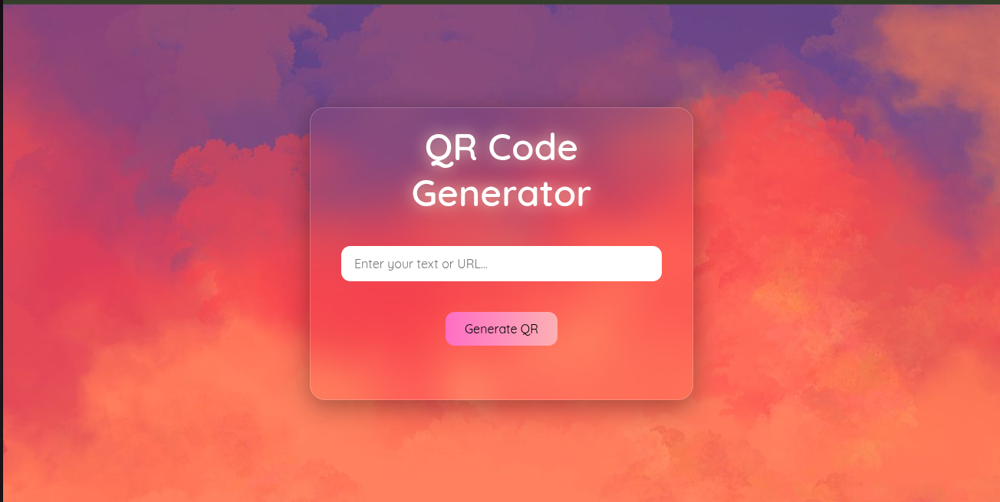
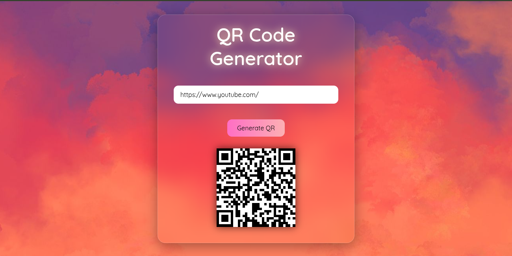

# QR Code Generator

A sleek and modern QR Code Generator web app. Easily generate QR codes by entering any text or URL.

## Features

- Simple input field to enter text or URL
- Generates QR code instantly with a button click
- Stylish UI with frosted glass transparency and soft gradients
- Responsive and visually appealing background with vibrant colors
- User-friendly and minimalistic interface

## Design Concept

The site uses a modern design style which includes:

- Transparent frosted glass effect for the main container
- Soft shadows and subtle gradients
- Rounded corners and smooth edges
- Eye-catching colorful background blending warm and cool tones

## Technologies Used

- HTML5
- CSS3 (including backdrop-filter for glass effect)
- JavaScript for QR code generation (library or custom implementation)

## Usage

Enter any text or URL in the input box and click the "Generate QR" button. The QR code will appear which you can scan using any QR code reader.

## Screenshots

